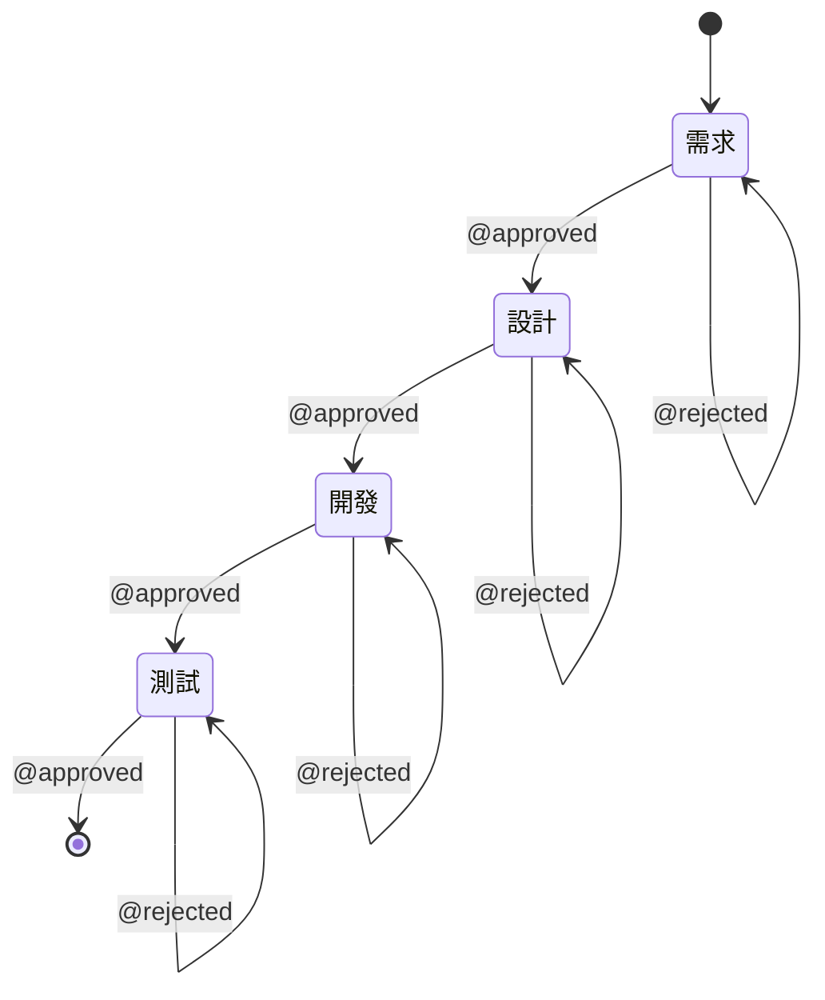

# 開發日誌 #1 - 兩個工具的誕生

## 緣起

這是一個關於**兩個獨立開發的工具最終發現彼此完美互補**的故事。

2025 年初，我開始思考一個問題：**如何讓 AI 真正成為開發流程的助手，而不僅僅是代碼補全工具？**

這個問題引導我分別開發了兩個工具，它們在不同的時間點誕生，卻朝著同一個目標前進。

## automation_tool：AI 的智能大腦

### 設計理念

**核心目標**：讓 AI 能夠真正理解專案，而不是盲目生成代碼。

傳統的 AI 輔助工具通常採用這樣的流程：
```
用戶描述需求 → AI 直接生成代碼 → 用戶修改調試
```

但這種方式有個致命問題：**AI 不理解你的專案架構**。它生成的代碼可能：
- 與現有架構不匹配
- 使用不存在的類別或方法
- 不符合專案的代碼風格
- 忽略現有的工具函數

automation_tool 的設計理念是：
```
需求 → 深度理解 → 結構化分析 → 探索專案 → 基於實際架構設計 → 生成代碼
```

### 技術架構

```
automation_tool/
├── requirement_analyzer/    # 需求分析模組
│   ├── analyzer.py         # 核心分析邏輯
│   └── templates/          # 9 章節需求模板
├── system_designer/         # 系統設計模組
│   ├── designer.py         # 核心設計邏輯
│   └── 4 個專案探索工具
├── code_generator/          # 代碼生成（規劃中）
├── validator/               # 驗證模組（規劃中）
└── documentation_generator/ # 文檔生成（規劃中）
```

### 關鍵創新：Tool Use API

automation_tool 的核心創新是使用 **Anthropic Tool Use API** 讓 AI 自主探索專案。

**4 個探索工具**：
1. `get_project_structure`：獲取專案目錄結構
2. `list_files`：列出指定目錄的文件
3. `search_code`：搜尋代碼中的模式
4. `read_file`：讀取具體文件內容

**迭代式對話**：最多 30 輪對話，讓 AI 像人類開發者一樣逐步理解專案：

```
Claude: "讓我先了解專案結構"
Tool: get_project_structure(max_depth=3)
返回: Assets/Scripts/UI, Assets/Scripts/Game, ...

Claude: "我需要找到主選單相關的代碼"
Tool: search_code(pattern="MainMenu", file_pattern="*.cs")
返回: MainMenuController.cs, MainMenuManager.cs

Claude: "讓我看看 MainMenuController 的實現"
Tool: read_file(file_path="Assets/Scripts/UI/MainMenuController.cs")
返回: [完整代碼]

Claude: "我還需要看看 UI 目錄下有哪些其他文件"
Tool: list_files(directory="Assets/Scripts/UI", pattern="*.cs")
返回: [文件列表]

... (可能進行 10-20 輪對話)
```

### 標準化文檔輸出

**需求文檔（9 章節）**：
1. 項目概述
2. 功能需求
3. 非功能需求
4. 用戶角色與權限
5. 使用場景
6. 數據需求
7. 接口需求
8. 限制條件與風險
9. 驗收標準

**設計文檔（11 章節）**：
1. 系統架構設計
2. 模塊設計
3. 數據模型設計
4. API 設計
5. 界面設計
6. 安全性設計
7. 性能優化策略
8. 錯誤處理與日誌
9. 部署方案
10. 測試策略
11. 維護與擴展

### 開發進度

| 模組 | 狀態 | 完成度 |
|------|------|--------|
| RequirementAnalyzer | ✅ 已完成 | 100% |
| SystemDesigner | ✅ 已完成 | 100% |
| CodeGenerator | ⏳ 規劃中 | 30% |
| Validator | ⏳ 規劃中 | 10% |
| DocumentationGenerator | ⏳ 規劃中 | 10% |

### 技術亮點

**1. System Prompt 工程**

RequirementAnalyzer 的 System Prompt 經過精心設計：
```python
SYSTEM_PROMPT = """你是一個專業的軟體需求分析師...
請嚴格按照以下 9 個章節生成需求文檔...
保持客觀、具體、可衡量..."""
```

**2. 多輪對話管理**

SystemDesigner 使用 Anthropic Messages API 的多輪對話功能：
```python
messages = []
for iteration in range(MAX_ITERATIONS):
    response = client.messages.create(
        model="claude-sonnet-4",
        messages=messages,
        tools=TOOLS
    )

    if response.stop_reason == "end_turn":
        break  # AI 完成探索

    if response.stop_reason == "tool_use":
        # 執行工具，添加結果到 messages
        tool_result = execute_tool(...)
        messages.append(tool_result)
```

**3. 多用戶隔離**

使用 `user_id` 和 `project_name` 進行輸出隔離：
```python
output_path = base_dir / user_id / project_name / "req.md"
```

## jira_poller：DevOps 的整合身體

### 設計理念

**核心目標**：將 AI 輔助開發整合到實際的企業工作流中。

automation_tool 解決了 AI 理解專案的問題，但還缺少：
- 如何觸發 AI 工作？
- 如何管理工作空間？
- 如何進行人工審批？
- 如何整合 Git 和 Jira？

jira_poller 的設計理念是：
```
Jira 任務驅動 → Git Worktree 隔離 → AI 階段性工作 → 人工審批 → Git 提交
```

### 技術架構

```
jira_poller/
├── task_poller.py          # 主輪詢器（30 秒輪詢）
├── jira_client.py          # Jira API 封裝
├── git_manager.py          # Git Worktree 管理
├── approval_checker.py     # 審批邏輯
├── orchestrator.py         # Agent 編排器
├── agent_files.py          # 文件管理
└── ai_provider.py          # AI Provider 抽象層
```

### 關鍵特性

#### 1. Jira 驅動

自動檢測帶有 `AI-Agent` 標籤的任務：
```python
def fetch_tasks(self):
    jql = f"""
        labels = "{self.target_label}"
        AND status IN ({self.target_statuses})
        ORDER BY priority DESC, created ASC
    """
    return self.jira.search_issues(jql)
```

#### 2. Git Worktree 隔離

每個任務獨立的工作空間：
```bash
workspace/
├── base-repo/           # 基礎倉庫
├── base-repo-wt-AG-1/   # 任務 AG-1 的 worktree
├── base-repo-wt-AG-2/   # 任務 AG-2 的 worktree
└── ...
```

**優勢**：
- 任務之間完全隔離
- 可同時處理多個任務
- 失敗不影響主分支
- 審批後可獨立 Merge

#### 3. 四階段人機協作



**審批指令**：
- `@approved`：通過，進入下一階段
- `@rejected`：拒絕，重新執行當前階段
- `@sendback`：退回上一階段
- `@restart`：從頭開始

#### 4. AI Provider 抽象層

支援多種 AI Provider：
```python
class AIProviderFactory:
    @staticmethod
    def create(provider_type: str, **kwargs):
        if provider_type == "claude":
            return ClaudeProvider(**kwargs)
        elif provider_type == "openai":
            return OpenAIProvider(**kwargs)
        elif provider_type == "ollama":
            return OllamaProvider(**kwargs)
        # ...
```

### 工作流程

**完整流程**：

```
1. Jira 任務提交（添加 AI-Agent 標籤）
   ↓
2. task_poller 檢測到新任務（30 秒輪詢）
   ↓
3. git_manager 創建 Git Worktree
   ↓
4. orchestrator 執行需求階段
   - AI 分析 Jira 任務描述
   - 生成需求文檔
   - 保存為 .ai-agent/{TASK_KEY}/req.md
   - 提交到 Git
   - 發表到 Jira
   ↓
5. 等待人工審批（@approved/@rejected）
   ↓
6. orchestrator 執行設計階段
   - AI 讀取需求文檔
   - 生成設計文檔
   - 保存為 .ai-agent/{TASK_KEY}/design.md
   - 提交到 Git
   - 發表到 Jira
   ↓
7. 等待人工審批
   ↓
8. orchestrator 執行開發階段
   - AI 實際修改代碼
   - 生成變更說明
   - 提交所有修改到 Git
   - 發表到 Jira
   ↓
9. 等待人工審批
   ↓
10. orchestrator 執行測試階段
    - AI 創建 Pull Request
    - 生成測試指引
    - 發表到 Jira
    ↓
11. 人工測試後 @approved 完成任務
```

### 開發困境

jira_poller 在開發過程中遇到了一個關鍵問題：

**需求和設計階段的 AI 分析太簡單**

初期實現：
```python
def _ai_generate_requirements(self, task, feedback):
    prompt = f"請分析以下任務：{task.description}"
    return ai_provider.generate(prompt)
```

這種簡單的 Prompt 導致：
- 需求文檔不夠深入（只有 500 字左右）
- 設計階段甚至只是占位符
- AI 無法理解現有專案結構
- 生成的文檔質量參差不齊

**我需要更強大的 AI 分析能力**，但自己從頭實現太耗時...

## 兩個工具的對比

| 維度 | automation_tool | jira_poller |
|------|----------------|-------------|
| **定位** | 通用 AI 工具 | Unity 工作流系統 |
| **核心能力** | AI 深度分析 | DevOps 整合 |
| **輸入** | 需求文本 | Jira 任務 |
| **輸出** | Markdown 文檔 | Git commits + Jira 評論 |
| **工作流** | 線性流程 | 人機協作循環 |
| **專案理解** | ✅ 自主探索 | ❌ 無 |
| **Jira 整合** | ❌ 無 | ✅ 完整整合 |
| **Git 管理** | ❌ 無 | ✅ Worktree 隔離 |
| **人工審批** | ❌ 無 | ✅ 四階段審批 |
| **優勢** | **AI 智能** | **工作流整合** |
| **劣勢** | 缺少工作流 | AI 分析簡單 |

## 發現契機

2025 年 10 月初，當我同時維護這兩個專案時，突然意識到：

> **它們是為同一個目標設計的！**

- automation_tool 有強大的 AI 大腦，但缺少身體（工作流）
- jira_poller 有完整的身體（DevOps 整合），但大腦簡單

如果將它們整合...

**automation_tool 的 AI 智能** + **jira_poller 的工作流整合** = **完整的自動化系統**

而且，兩者的接口天然契合：
- 都輸出 Markdown 文檔
- 都需要專案路徑作為輸入
- 需求→設計的流程完全匹配

這就是整合的開始。

## 下一步

在下一篇日誌中，我將詳細記錄**整合的設計與實施過程**：
- 如何選擇整合方案？
- 如何讓 SystemDesigner 探索 Git Worktree？
- 如何處理異步調用？
- 如何實現優雅降級？

→ 繼續閱讀：[[專案/AI自動化Unity工作流整合/日誌/02-整合設計與實施|#2 整合設計與實施]]

---

返回 [[專案/AI自動化Unity工作流整合/index|專案主頁]]
