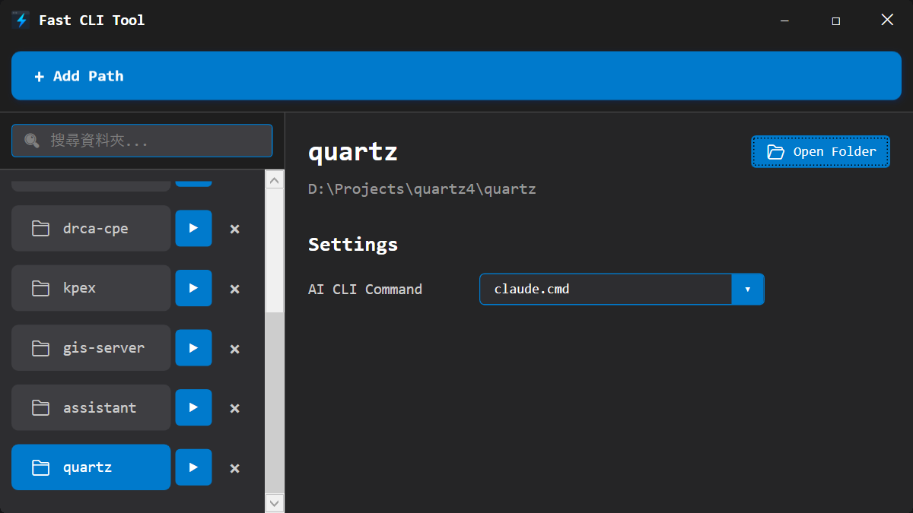

# Fast CLI Tool

## 專案簡介

Fast CLI Tool 是「助手系列」的第一個工具，專為提升開發效率而生。它提供一個集中管理專案路徑的介面，並支援在指定目錄下快速啟動各種 AI CLI 工具，讓開發者能夠快速進行多工開發。

## 主要功能

- **專案路徑管理**：集中儲存和管理常用專案路徑
- **快速啟動**：一鍵在指定目錄啟動 AI CLI 工具
- **搜尋過濾**：快速搜尋已儲存的專案
- **AI 工具整合**：支援 claude.cmd 等 AI CLI 工具
- **開啟資料夾**：直接開啟專案所在目錄

## 技術棧

- 語言/框架：C#、WPF
- AI 協作工具：Claude Code
- 開發模式：Vibe Coding
- 圖像生成：ChatGPT 5

## 開發日誌

開發過程的詳細記錄：

1. [[01-初始構想|#1 初始構想]] - 專案起源與需求分析
2. [[02-核心開發|#2 核心開發]] - 主要功能實作

## 相關連結

- GitHub: （待補充）
- Demo: （待補充）

---

返回 [[專案/index|所有專案]]
